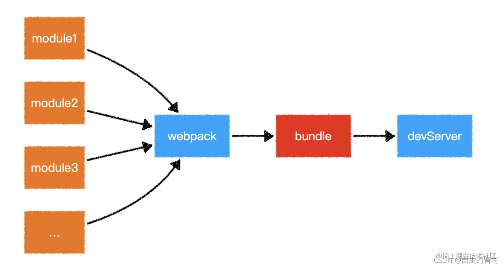
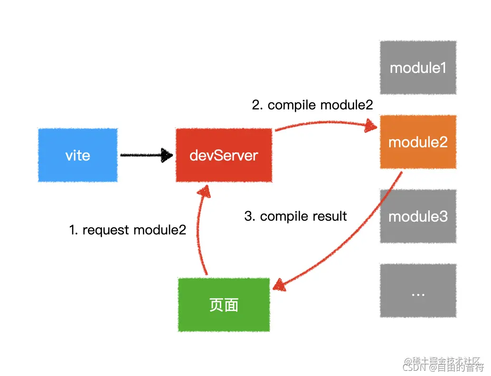

# 安裝Vue
### CDN引入

```html
<div id="app">{{ message }}</div>
<script src="https://unpkg.com/vue@next"></script>
<script>
	const { createApp } = Vue
    createApp({
        data() {
            return {
                message: 'Hello Vue!'
            }
           }
    }).mount('#app')
</script>
```

### npm

1. **vue - cli(webpack)**

   ```sh
   yarn global add @vue/cli
   # 或
   npm install -g @vue/cli
   ```

   ```sh
   vue create my-project
   # OR
   vue ui
   ```

2. **Vite**

   npm: 

   ```sh
   # npm 6.x
   npm init vite@latest <project-name> --template vue
   
   # npm 7+，需要加上额外的双短横线
   npm init vite@latest <project-name> -- --template vue
   
   cd <project-name>
   npm install
   npm run dev
   ```

   yarn: 

   ```sh
   yarn create vite <project-name> --template vue
   cd <project-name>
   yarn
   yarn dev
   ```

##### Vue CLI 和vite的優缺點

   | Vue CLI 优点               | Vue CLI 缺点                   |
   | :------------------------- | :----------------------------- |
   | 经历过战斗考验，可靠       | 开发服务器速度与依赖数量成反比 |
   | 与 Vue 2 兼容              |                                |
   | 可以捆绑任何类型的依赖关系 |                                |
   | 插件生态系统               |                                |
   | 可以针对不同的目标进行构建 |                                |

   | Vite 优点                         | Vite 缺点                         |
   | :-------------------------------- | :-------------------------------- |
   | 开发服务器比 Webpack 快 10-100 倍 | 只能针对现代浏览器（ES2015+）     |
   | 将 code-splitting 作为优先事项    | 与 CommonJS 模块不完全兼容        |
   |                                   | 处于测试阶段，仅支持 Vue 3        |
   |                                   | 最小的脚手架不包括 Vuex、路由器等 |
   |                                   | 不同的开发服务器与构建工具        |

webpack:



vite:


