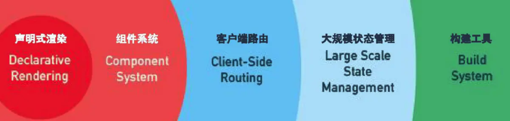

# 認識vue
Vue ( 發音為/vjuː/，類似 **view**) 是一款用於構建用戶界面的 JavaScript 框架([漸進式框架](#a))，Vue被設計為[自底向上逐層應用](#b)，Vue 的核心庫只關注視圖層，易於上手，還便於與第三方庫或既有項目整合。
<h3 id='a'> 漸進式框架 </h3>

**提供足夠的選擇，併且沒有很多強制性的要求**

漸進也可以理解為一步一步的意思，大概意思就是使用Vue的時候，併不需要把整個框架的所有東西都用上，可以根據實際情況選擇妳需要的部分。如下圖：



聲明式渲染和組建繫統是Vue的核心庫所包含內容，而客戶端路由(vue router)、狀態管理(vuex)、構建工具(webkit/vite)都有專門解決方案。這些解決方案相互獨立，妳可以在核心的基礎上任意選用其他的部件，不一定要全部整合在一起。

- **聲明式渲染**：Vue 通過自己的模板語法(單文件組件)擴展了標準 HTML，使得我們可以聲明式地描述基於 JavaScript 狀態輸出的 HTML。

- **響應性**：Vue 會自動跟蹤 JavaScript 狀態變化並在改變發生時響應式地更新 DOM。

- **單文件組件**: 在大多數啟用了構建工具的 Vue 項目中， 一種類似 HTML 格式的文件來書寫 Vue 組件，它被稱為**單文件組件** (也被稱為 `*.vue` 文件，英文縮寫為 **SFC**)，Vue 的單文件組件會將一個組件的邏輯 (JavaScript)，模板 (HTML) 和樣式 (CSS) 封裝在同一個文件裏。


<button @click="count++">Count is: {{ count }}</button>

<script>
export default {
  data() {
    return {
      count: 0
    }
  }
}
</script>

<style scoped>
    button {
    font-weight: bold;
    }
</style>


  ```vue
  <script>
  export default {
    data() {
      return {
        count: 0
      }
    }
  }
  </script>
  
  <template>
    <button @click="count++">Count is: {{ count }}</button>
  </template>
  
  <style scoped>
  button {
    font-weight: bold;
  }
  </style>
  ```


聲明式渲染的理解：

1. DOM狀態只是數據狀態的一個映射
2. 所有的邏輯盡可能在狀態的層面去進行
3. 當狀態改變了，view會被框架自動更新到合理的狀態

區別聲明式渲染和命令式渲染:

- 命令式：需要以具體代碼表達在哪裏做什麼？它是如何實現的
- 聲明式：只需要聲明在哪裏需要做什麼？不需要關心具體怎麼實現的


<h3 id='b'> 自底向上逐層應用 </h3>

由基層開始做起，把基礎的東西寫好，再逐層往上添加效果和功能


