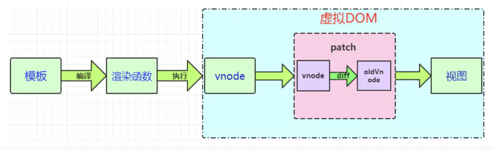

# Vue的工作機制

### Vue模块组成

以一個簡單Vue組件從創建到渲染到web頁面的過程，來看Vue的工作機製。

Vue共有三個核心模塊，分別是: 

|   Vue Modules   |   名稱   |
| :-------------: | :------: |
| Reactive Module | 響應模塊 |
| Compiler Module | 編譯模塊 |
| Renderer Module | 渲染模塊 |

其中渲染模塊分為三個階段，分別是：

- Render phase 渲染階段
- Mount phase 掛載階段
- Patch phase 補丁階段

### 工作過程

1.  首先，編譯模塊會將HTML模板編譯成一個render 函數。響應模塊初始化響應式對象。

2. 渲染模塊進入第一階段：渲染。

調用render 函數，為其建立一個指向響應式對象的引用，返回一個虛擬dom。

3. 渲染模塊進入第二階段：掛載。

調用mount函數，使用虛擬dom創建頁面。

4. 最後，如果被監視的響應式對象發生了變化，渲染模塊就進入第三階段：補丁。

先重新調用render函數，創建一個新的虛擬dom。

與舊的虛擬dom比較，頁面只改變不同的部分，重新加載web頁面。

### 虛擬dom

虛擬dom（Virtual DOM）： 是利用 js 描述元素與元素的關系，用 js 對象來表示真實的 DOM 樹結構，創建一個虛擬 DOM 對象

**為什麼要使用虛擬dom**

Web界面由DOM樹(樹的意思是數據結構)來構建，當其中一部分發生變化時，其實就是對應某個DOM節點發生了變化。

原生JS或JQ操作DOM時，瀏覽器會從構建DOM樹開始從頭到尾執行一遍流程。在一次操作中，我需要更新10個DOM節點，瀏覽器收到第一個DOM請求後並不知道還有9次更新操作，因此會馬上執行流程，最終執行10次。

一次操作中有10次更新DOM的動作，虛擬DOM不會立即操作DOM，而是將這10次更新的diff內容保存到本地一個JS對象中，最終將這個JS對象一次性attch到DOM樹上，再進行後續操作，避免大量無謂的計算量。

**Virtual DOM的優缺點**

- 優點：
  1. 最終表現在DOM上的修改只是變更的部分，可以保證非常高效的渲染。
  2. 提升了性能（JavaScript對象比DOM對象性能高），抽象了DOM的具體實現（對DOM進行了一層抽象）
  3. 可以跨平台
- 缺點：
  1. 首次渲染大量DOM時，由於多了一層虛擬DOM的計算，會比innerHTML插入慢。

**diff 算法包括幾個步驟：**

- 用 JavaScript 對象結構表示 DOM 樹的結構；然後用這個樹構建一個真正的 DOM 樹，插到文檔當中
- 當狀態變更的時候，重新構造一棵新的對象樹。然後用新的樹和舊的樹進行比較，記錄兩棵樹差異
- 把所記錄的差異應用到所構建的真正的DOM樹上，視圖就更新了
