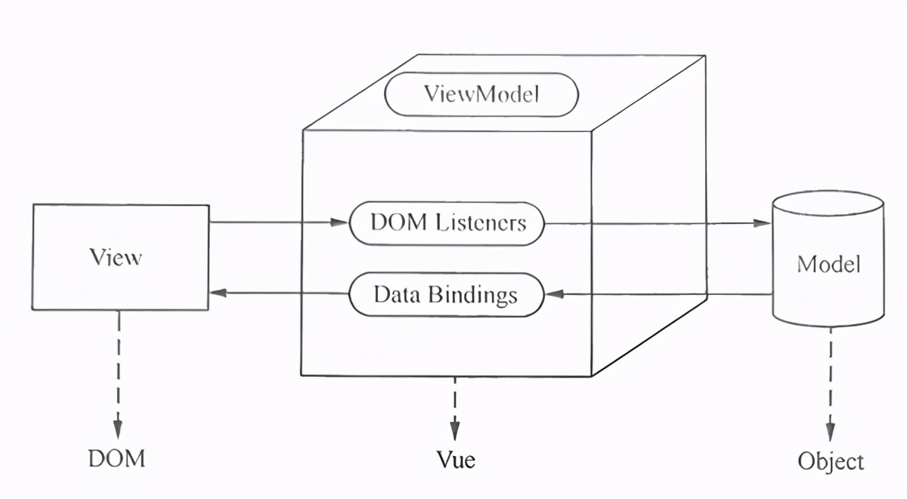

# Vue的工作原理

Vue的數據驅動通過mvvm(model-view-viewmodel )模式實現，其基本工作原理如下圖所示：

由上圖可見，MVVM主要由模型、視圖和視圖模型三部分組成.

1. Model是指數據部分，主要負責業務數據的
2. View是指視圖的部分，也就是DOM元素，負責處理視圖。
3. ViewModel是連接視圖和數據的數據模型，用於攔截模型或視圖的更改

MVVM無法直接與數據模型和視圖視圖進行通信。 視圖模型ViewModel相當於觀察者，監視雙方的動作，及時通知進行適當的操作。 當Model發生變化時，ViewModel可以攔截該變化，並通知View適當的修改。 相反，當View發生變化時，ViewModel在攔截變化後，通知Model修改，解除視圖和模型的相互連接。