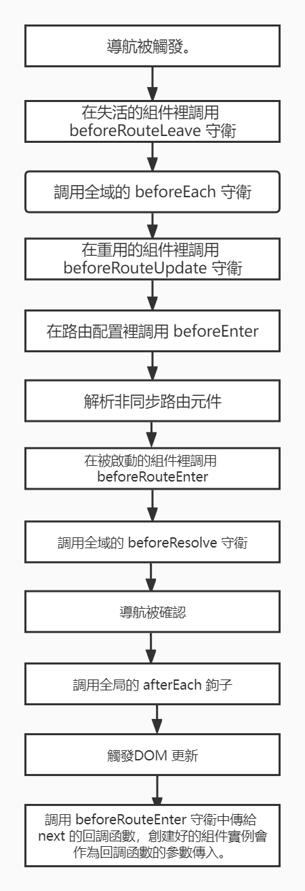

## 全域事件

### 全域前置守衛

 使用 `router.beforeEach` 註冊一個全域前置守衛

```js
const router = createRouter({ ... })

router.beforeEach((to, from, next) => {
  // ...
  // 返回 false 以取消导航
  return false
})
```

每個守衛方法接收兩個參數

- **to**: 即將要進入的路由
- **from**: 當前導航正要離開的路由 
- 可選參數` next`

確保 `next` 在任何給定的導航守衛中都被**嚴格調用一次**。它可以出現多於一次，但是只能在所有的邏輯路徑都不重疊的情況下，否則鉤子永遠都不會被解析或報錯

``` js
router.beforeEach((to, from, next) => {
  if (to.name !== 'Login' && !isAuthenticated) next({ name: 'Login' })
  else next()
})
```

### 全域解析守衛

用 `router.beforeResolve` 註冊一個全域守衛。這和 `router.beforeEach` 類似，因為它在 **每次導航**時都會觸發，但是確保在導航被確認之前，**同時在所有元件內守衛和非同步路由元件被解析之後，解析守衛就被正確調用**

```js
router.beforeResolve(async to => {
  if (to.meta.requiresCamera) {
    try {
      await askForCameraPermission()
    } catch (error) {
      if (error instanceof NotAllowedError) {
        // ... 處理錯誤，然後取消導航
        return false
      } else {
        // 意料之外的錯誤，取消導航並把錯誤傳給全域處理器
        throw error
      }
    }
  }
})
```

###  全域後置鉤子

也可以註冊全域後置鉤子，然而和守衛不同的是，這些鉤子不會接受 `next` 函數也不會改變導航本身：

```
router.afterEach((to, from, failure) => {
  sendToAnalytics(to.fullPath)
})
```

第三個參數`failure`代表導航故障

## 路由獨享的守衛

 

## 組件內的守衛

為路由元件添加以下配置：

- `beforeRouteEnter`
- `beforeRouteUpdate`
- `beforeRouteLeave`

```js
export default {
  beforeRouteEnter (to, from) {
    // 在渲染該組件的對應路由被驗證前調用
    // 不能獲取元件實例 `this` ！
    // 因為當守衛執行時，元件實例還沒被創建！
  },
  beforeRouteUpdate (to, from) {
    // 在當前路由改變，但是該組件被覆用時調用
    // 舉例來說，對於一個帶有動態參數的路徑 `/users/:id`，在 `/users/1` 和 `/users/2` 之間跳轉的時候，
    // 由於會渲染同樣的 `UserDetails` 元件，因此元件實例會被覆用。而這個鉤子就會在這個情況下被調用。
    // 因為在這種情況發生的時候，元件已經掛載好了，導航守衛可以訪問元件實例 `this`
  },
  beforeRouteLeave (to, from) {
    // 在導航離開渲染該組件的對應路由時調用
    // 與 `beforeRouteUpdate` 一樣，它可以訪問元件實例 `this`
  }
}
```

`beforeRouteEnter` 守衛 **不能** 訪問 `$this`，因為守衛在導航確認前被調用，因此即將登場的新組件還沒被創建。

通過傳一個回檔給 `next` 來訪問元件實例。在導航被確認的時候執行回檔，並且把元件實例作為回檔方法的參數：

```js
beforeRouteEnter (to, from, next) {
  next(vm => {
    // 通過 `vm` 訪問元件實例
  })
}
```

 對於 `beforeRouteUpdate` 和 `beforeRouteLeave` 來說，`$this` 已經可用了

## 完整的導航解析流程

 

